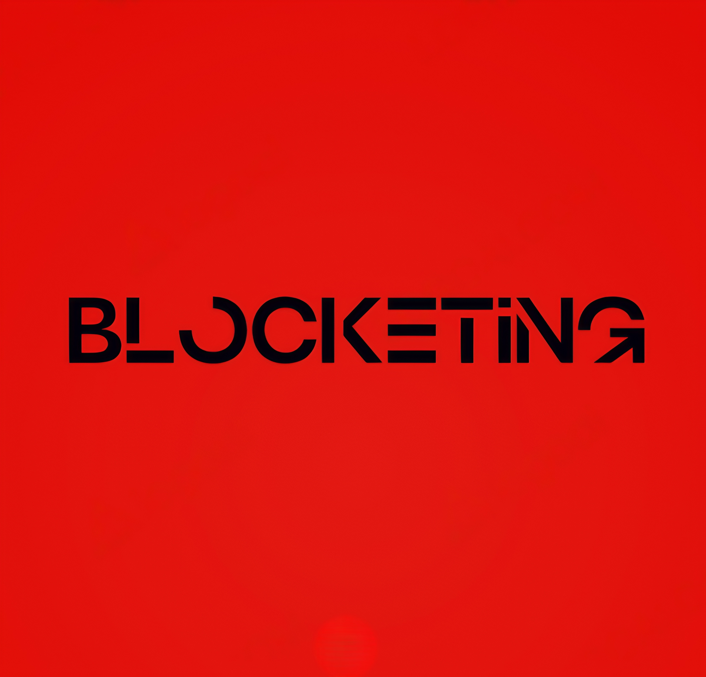

<div align="center">
  
  <h1 align="center">Blocketing Bot</h1>
  <h3>Integrate Discord with Minecraft for seamless communication and command execution</h3>
</div>

## 🔗 Related Repositories
- [Blocketing Fabric Mod](https://github.com/crunnna/blocketing-fabric-mod.git): A Fabric mod for seamless communication between a Discord channel and a Minecraft server, enabling bidirectional message synchronization and command execution. communication between a Discord channel and a Minecraft server, enabling bidirectional message synchronization.

## ✨ Features
- **Message Relay**: Send messages from a specific Discord channel to a Minecraft server. 💬
- **Command Execution**: Execute Minecraft commands from Discord with proper permissions. 🛠️
- **Embed Messages**: Display command execution results in a rich embed format. 📜

## ⚡ Getting Started
> [!IMPORTANT]
> To set up your Blocketing Bot, begin by cloning the repository and installing the dependencies. Once installed, create a `.env` file in the root directory and add your configuration.
> ```sh
> git clone https://github.com/crunnna/blocketing-bot.git
> cd blocketing-bot
> npm install
> ```
> Add your configuration to the `.env` file:
> ```env
> DISCORD_CLIENT_ID=your_discord_client_id
> DISCORD_TOKEN=your_discord_token
> DISCORD_GUILD_ID=your_discord_guild_id
> DISCORD_CHANNEL_ID=your_discord_channel_id
> OP_ROLE_ID=your_op_role_id
> PORT=3000
> MINECRAFT_SERVER_URL=http://your.minecraft.server.url
> ```

## 🚀 Usage
> ### Starting the Bot
> You can start the bot with the following command:
> ```sh
> npm start
> ```
> The bot will log in to Discord and start listening for messages and commands.

## 🌐 Environment Variables
- `DISCORD_CLIENT_ID`: The ID of the Discord application (Bot ID/Client ID).
- `DISCORD_TOKEN`: The token of the Discord application (Bot token).
- `DISCORD_GUILD_ID`: The ID of the Discord server.
- `DISCORD_CHANNEL_ID`: The ID of the Discord channel.
- `OP_ROLE_ID`: The ID of the role that can execute commands.
- `PORT`: The port the bot will run on.
- `MINECRAFT_SERVER_URL`: The URL of the Minecraft server.

## 🙏 Acknowledgements
- [discord.js](https://discord.js.org/) for the Discord API library.
- [Express](https://expressjs.com/) for the web server framework.
- [dotenv](https://github.com/motdotla/dotenv) for managing environment variables.

### For any questions or issues, please open an issue on this repository. I'm here to help!